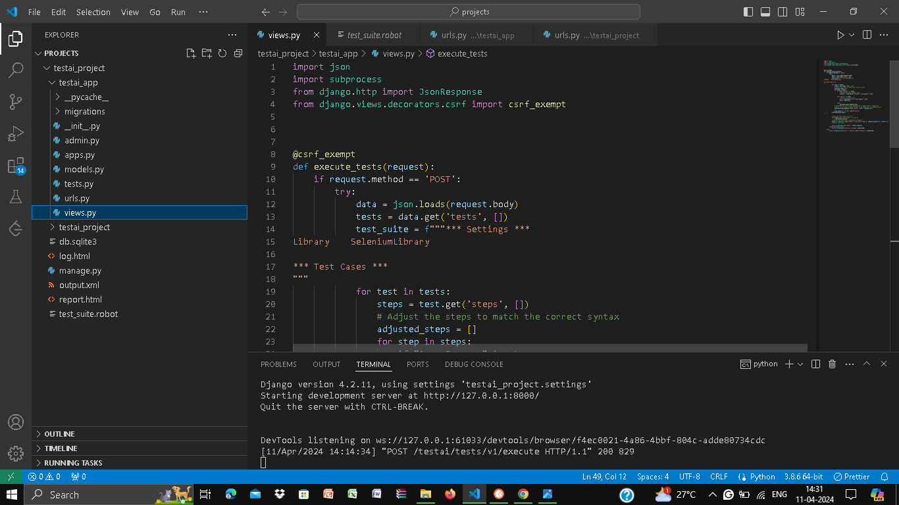
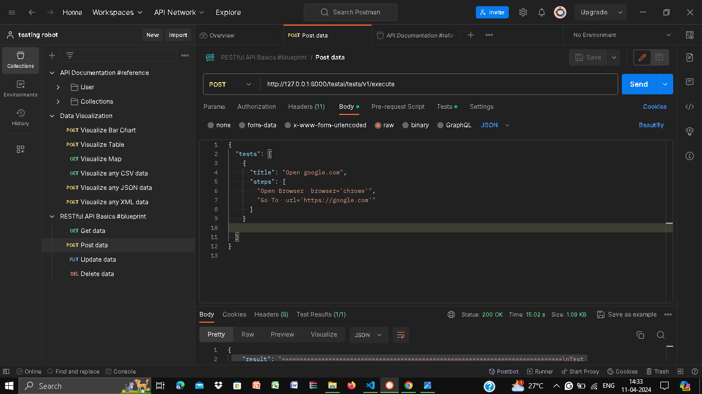
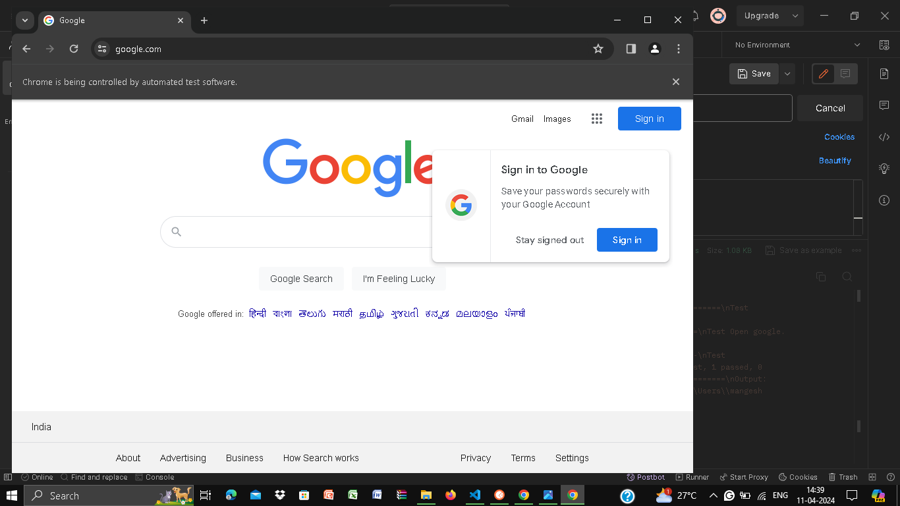
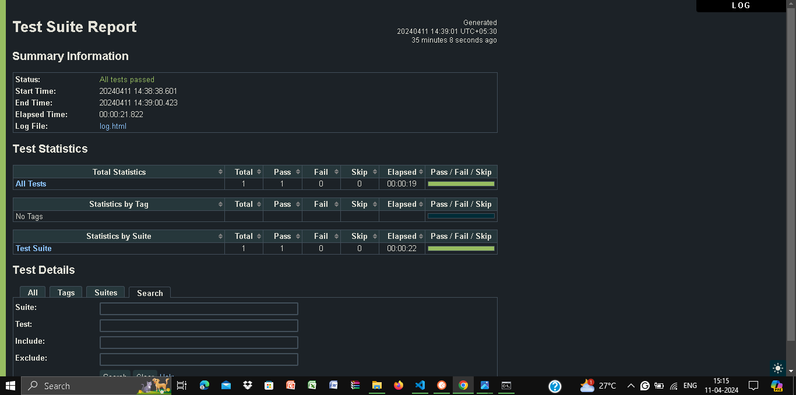

# QuoDroid_Test

# Automated Test Execution with Python, Django, and Robot Framework

## Overview

A solution for automated test execution using Python, Django, and Robot Framework. This project was developed as a response to a recruitment challenge

The core objective of this project is to create an application that accepts a detailed POST method API call, executes the testing steps provided within as a Robot Framework test, and returns the test output.

## Demonstration-Images
- File Structure



- POST METHOD
 


- Automated Chrome and Google.com search after .robot execution
 


- Test Suite Report ==> Test Case passed



## Requirements

- Python 3.x
- Django
- Robot Framework
- Robotframework-seleniumlibrary
- Selenium

## Installation

1. Clone this repository to your local machine:

    ```bash
    git clone <repository_url>
    ```

2. Install the required dependencies using pip:

    ```bash
    pip install -r requirements.txt
    ```

## Usage

-Before execution make sure all the dependencies from requirements.txt are installed

1. Change the directory to testai_project
     ```bash
    cd testai_project
    ```
2. Start the Django server:

    ```bash
    python manage.py runserver
    ```

3. Make a POST request to the following endpoint:

    - Endpoint: http://127.0.0.1:8000/testai/tests/v1/execute
    - Method: POST
    - Headers: Content-Type: application/json
    - Body:

    ```json
    {
        "tests":[
            {
                "title":"Open google.com",
                "steps":[
                    "Open Browser browser='chrome'",
                    "Go To url='https://google.com'"
                ]
            }
        ]
    }
    ```

4. The system will execute the provided test steps using Robot Framework and return the results.

## Result Example

Upon making a POST request, you will receive a JSON response containing the test execution results. Here's an example of what the result may look like:

```json
{
"result": "==============================================================================\n
            Test Suite                                                                    \n
            ==============================================================================\n
            Test Open google.com                                                  | PASS |\n
            ------------------------------------------------------------------------------\n
            Test Suite                                                            | PASS |\n
            1 test, 1 passed, 0 failed\n
            ==============================================================================\n"
}
```
- Automated Chrome and Google.com search after .robot execution
 


- Test Suite Report ==> Test Case passed, the report can be obtained from report.html generated after the API call


## Project Structure

- `execute_tests` Django view handles the API endpoint for test execution.
- `test_suite.robot` file dynamically generated to define Robot Framework test cases.
- `requirements.txt` lists the project dependencies.


## Contribution

Contributions are welcome! If you find any issues or have suggestions for improvements, feel free to open an issue or create a pull request.

## License

This project is licensed under the [MIT License](LICENSE).

---
